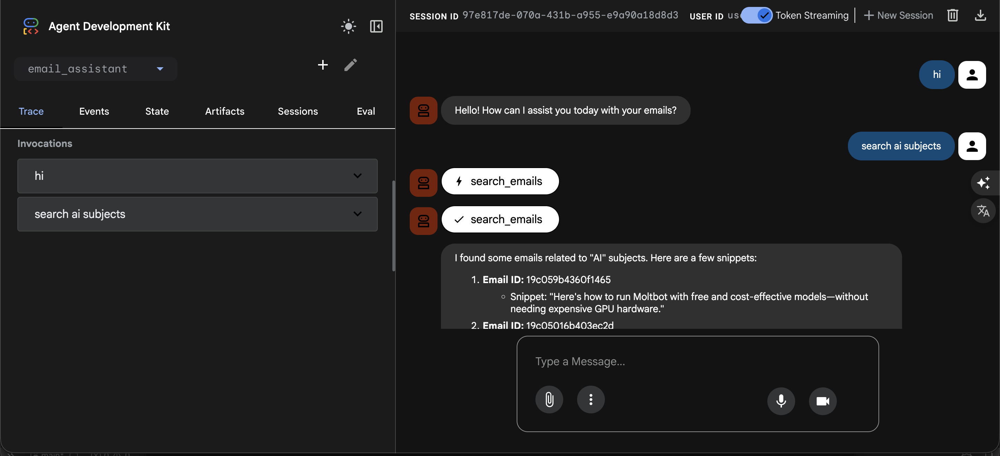

# AI Email Assistant - Technical Assessment

## 🎯 Overview
A professional AI-powered email assistant built using the **Google Agent Development Kit (ADK)**. This agent automates Gmail workflows including searching for emails, retrieving full content, and drafting responses with a strict **Human-in-the-Loop** approval process.

## 🏗️ Technical Stack
*   **Framework**: Google ADK (Agent Development Kit)
*   **LLM**: OpenAI GPT-4o (via LiteLLM)
*   **Integration**: Gmail API (OAuth2)
*   **Environment**: Python 3.12+

## ✅ Features Implemented
*   **Email Search**: Search for emails using subjects or keywords.
*   **Email Detail Retrieval**: Extracts Sender, Subject, and full Body content.
*   **Draft Generation**: Automatically generates contextual, professional replies.
*   **Human-in-the-Loop**: The agent presents drafts and waits for explicit user approval before sending.
*   **Secure Sending**: Real implementation of Gmail API 'send' functionality.

## 🚀 Quick Start

### 1. Prerequisites
*   Python 3.9+
*   Google Cloud Project with Gmail API enabled.

### 2. Configuration
Create a `.env` file in the root directory:
```env
# OpenAI
OPENAI_API_KEY=your_openai_api_key
OPENAI_MODEL=gpt-4o

# Google Gmail API
GOOGLE_CREDENTIALS_FILE=credentials.json
GOOGLE_TOKEN_FILE=token.json
GOOGLE_SCOPES=https://mail.google.com/
```

Place your `credentials.json` (downloaded from Google Cloud Console) in the project root.

### 3. Installation
```bash
pip install -r requirements.txt
```

### 4. Run

#### Option A: Terminal Interface
```bash
python3 main.py
```

#### Option B: ADK Web UI (Recommended)
```bash
python3 -m google.adk.cli web --port 8080 .
```
Then open **http://127.0.0.1:8080** in your browser.

On the first run, it will open a browser for Google OAuth authentication.

## 🌐 ADK Web Interface

The ADK Web UI provides a rich interactive experience for testing and debugging the agent.



### Features:
*   **Agent Selection**: Choose the `email_assistant` agent from the dropdown.
*   **Chat Interface**: Send messages and receive responses in real-time.
*   **Tool Tracing**: View `search_emails`, `get_email_details`, and `send_email` tool invocations.
*   **Session Management**: Start new sessions or continue existing ones.
*   **Events & State**: Inspect the internal state and event flow of the agent.

### Usage:
1. Start the web server: `python3 -m google.adk.cli web --port 8080 .`
2. Open http://127.0.0.1:8080
3. Select `email_assistant` from the agent dropdown
4. Type your request (e.g., "search ai subjects")
5. Watch the agent reason and invoke tools in real-time

## 🛡️ Security & Privacy
*   **OAuth2**: Uses secure refresh token rotation.
*   **No Hardcoding**: All secrets are managed via environment variables.
*   **Explicit Consent**: The agent is programmed to never send an email without user confirmation.

## 📋 Assumptions & Design Decisions

### Architecture Decisions
1. **Google ADK Framework**: Chose Google ADK over LangChain for its native agent-with-tools architecture and built-in ReAct pattern support.
2. **LiteLLM Integration**: Used `google.adk.models.LiteLlm` to connect OpenAI GPT-4o, providing flexibility to swap LLM providers.
3. **Factory Pattern**: Implemented `AgentFactory` class to ensure consistent agent creation across CLI and Web interfaces (no code duplication).
4. **Singleton Pattern**: Applied to `Config` and `GmailService` for efficient resource management.

### Functional Assumptions
1. **Email Search**: The agent searches by subject/keywords using Gmail's query syntax. If no emails are found, it gracefully informs the user.
2. **Human-in-the-Loop**: The agent is instructed to **always** present drafts and wait for explicit user approval before sending. It will never auto-send.
3. **Reply-To Logic**: When sending replies, the agent extracts the sender's email from the original message and uses it as the recipient.
4. **Error Handling**: All Gmail API errors are caught and returned as structured error responses to the agent for graceful handling.

### Technical Assumptions
1. **Gmail Scopes**: Uses `https://mail.google.com/` for full Gmail access (read, send, modify).
2. **Token Refresh**: OAuth2 tokens are automatically refreshed when expired.
3. **Max Results**: Email search returns up to 5 results to keep context manageable.

## 📁 Project Structure
```
├── main.py                      # Terminal interface entry point
├── requirements.txt             # Python dependencies
├── README.md                    # This file
├── .env.example                 # Environment template
├── credentials.json             # Google OAuth credentials (user-provided)
├── token.json                   # Generated OAuth token (auto-created)
├── email_assistant/             # ADK Web UI agent package
│   ├── __init__.py
│   └── agent.py                 # Exports root_agent for ADK CLI
└── src/
    ├── core/
    │   ├── config.py            # Environment configuration (Singleton)
    │   └── gmail_service.py     # Gmail API service (Singleton)
    ├── tools/
    │   └── gmail_tools.py       # search_emails, get_email_details, send_email
    └── agents/
        └── email_agent.py       # AgentFactory, EmailAgent, SYSTEM_PROMPT
```

## 🧪 Example Interaction

```
👤 User: Can you help me respond to the email about the project proposal follow-up?

🤖 Agent: I'll search for that email.
   [Tool: search_emails("project proposal follow-up")]

🤖 Agent: I found an email from john@example.com:
   Subject: Project proposal follow-up
   From: john@example.com
   Body: Hi, I wanted to follow up on the proposal we sent last week...

🤖 Agent: Here's my suggested reply:
---
Hi John,
Thank you for following up. I've reviewed the proposal and have a few questions...
---

Would you like me to send this reply?

👤 User: yes

🤖 Agent: Reply sent successfully!
```
